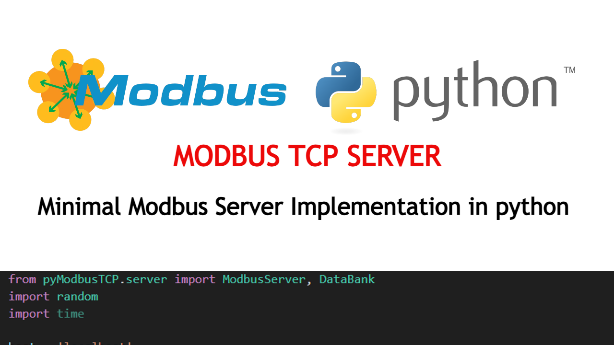

## Modbus TCp Server in Python
This is an implementation of a Modbus TCP Server Implementation in Python. The server accepts connections and requests from modbus clients regardless of their implementations to read and write registers.

The ```server_minimal``` is a basic implementation where only the clinet can write slave registers. The```server_dynamic_data``` on the other hand demonstrates how the server can set dynamic data to its registers which is then read by the client

### Instructions
- Install the ```pyModbusTCP``` library by running the following command: ```pip install pyModbusTCP```. 
- Set your prefered ethernet interface and port on which the server will listen by setting the ```host``` and ```port``` varaibles. The ```0.0.0.0``` will map to all interfaces
- Run the script, for example: ```python server_minimal.py```

### Demo and usage
- Click Video below to watch
[](https://youtu.be/7m71nT5qZwk)
